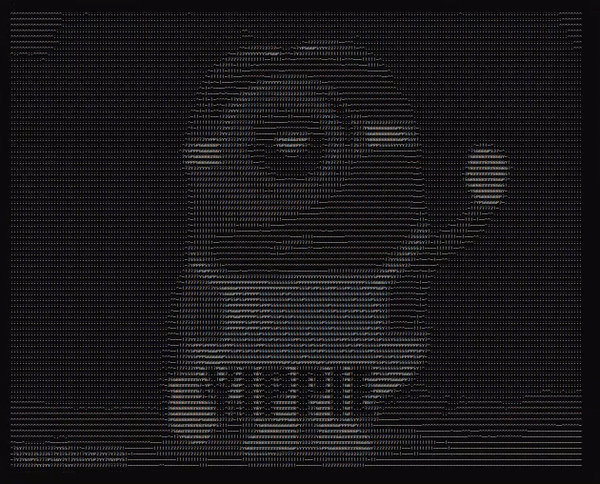

# ascii-animation-haskell
Brief minion animation: Trying ascii art and importing text file



## Try it with Docker

Build the Dockerfile:
```bash
git clone https://github.com/gerardVM/ascii-animation-haskell.git &&
cd ascii-animation-haskell &&
docker build --no-cache -t ascii-animation-haskell . &&
docker run --rm -it ascii-animation-haskell
```
or run the pre-built Docker image
```bash
docker run --rm -it gerardvm/ascii-animation-haskell
```
